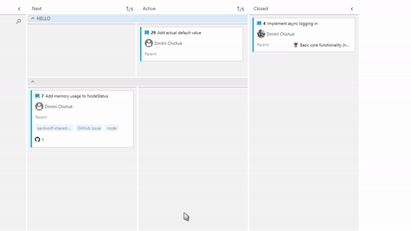
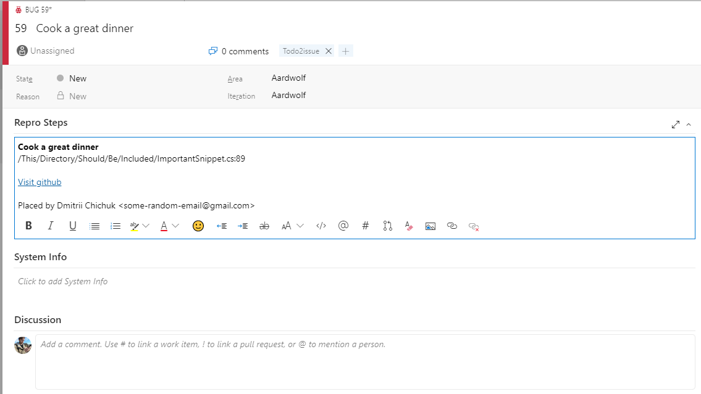

# TODO-2-AzDO

This action runs through your recent changes and closes all corresponding AzDO work items if relevant `TODO` comments were removed in a pushed commit, and converts all newly added TODO comments to new AzDO work items.

## Demo



## Screenshot



## Usage

Create a workflow file in your .github/workflows/ directory as follows:
 
### todo-2-azdo.yaml

    name: "TODO-2-AzDO"
    on: ["push"]
    jobs:
      build:
        runs-on: "ubuntu-latest"
        steps:
          - uses: "actions/checkout@master"
          - name: "TODO-2-AzDO"
            uses: "jamminroot/todo-2-azdo"
            with:
              TOKEN: ${{ secrets.GITHUB_TOKEN }}
              AZDO_TOKEN: ${{ secrets.AZDO_TOKEN}}
              AZDO_ORGANIZATION: ${{ secrets.AZDO_ORGANIZATION}}
              AZDO_TEAM: ${{ secrets.AZDO_TEAM}}
              AZDO_PROJECT: ${{ secrets.AZDO_PROJECT}}
              AZDO_LANE: "TODOs"
              AZDO_CLOSED: "Closed"
              AZDO_NEW: "New"
              TODO_PATTERN: "(?<=\\/\\/ ?TODO[ :]).+"
              LABEL: "TODO"
              TRIM: ",: \""
              TIMEOUT: 1000
              LINES_BEFORE: 2
              LINES_AFTER: 5
              LABELS_PATTERN: "(?<=\\[).+?(?=\\])"
              LABELS_REPLACE_PATTERN: "\\[(.+?)\\]"
              IGNORED_LINES_LENGTH: 255
              EXCLUDED_PATHS: /FilePath/ToExclude/1|/FilePath/ToExclude/2
              INCLUDED_PATHS: /FilePath/ToExclude/1/Exception|/FilePath/ToExclude/2/Exception
              FILE_PATTERN: ".*cs"
            id: "todo-2-azdo"

> **NOTE:** Keep in mind that you have to escape slashes in regex patterns when putting them to yml

> **NOTE:** Always put values for `TOKEN`, `AZDO_TOKEN` as secrets in github action preferences.
> Consider hiding `AZDO_ORGANIZATION`, `AZDO_TEAM` and `AZDO_PROJECT` if that might concern you.

### Inputs

| Input    | Description |
|----------|-------------|
| `TOKEN` | The GitHub access token to allow us get diff and commit history. |
| `AZDO_TOKEN` | The Azure DevOps PAT which would allow us manage items (Consider reducing scope to Work Items: Manage). |
| `AZDO_ORGANIZATION` | The Azure DevOps Organization to use. |
| `AZDO_TEAM` | The Azure DevOps Team to use. |
| `AZDO_PROJECT` | The Azure DevOps PAT Project to use. |
| `AZDO_LANE` | The Azure DevOps lane to put new workitems to. |
| `AZDO_CLOSED` | The Azure DevOps column to move closed workitems to. |
| `AZDO_NEW` | The Azure DevOps column to move new workitems to. |
| `TODO_PATTERN` | Regex pattern used to identify TODO comment. Default is `(?<=\\/\\/ ?TODO[ :]).+` for `// TODO`. |
| `LABEL` | Label to add to a ticket. |
| `TRIM` | Set of characters (as a string) to be trimmed from resulting title. |
| `TIMEOUT` | Delay between requests. |
| `LINES_BEFORE` | How many lines above `// TODO` to include to snippet. |
| `LINES_AFTER` | How many lines after `// TODO` to include to snippet. |
| `LABELS_PATTERN` | Regex to parse inlined labels. If empty, they will be left in todo. Default is text inside square brackets. |
| `LABELS_REPLACE_PATTERN` | Regex to replace inlined labels. Only works when LABELS_PATTERN provided. Default is text with square brackets. |
| `IGNORED_LINES_LENGTH` | Maximum length of diff line to be processed by action. Useful for binary data (e.g. Unity repos). Ignored if 0. |
| `EXCLUDED_PATHS` | List of vertical line-separated file paths to be excluded from processing. |
| `INCLUDED_PATHS` | List of vertical line-separated file paths to be included to processing OR a list of exceptions if EXCLUDED_PATHS is not empty. |
| `FILE_PATTERN` | Maximum length of diff line to be processed by action. Useful for binary data (e.g. Unity repos). Ignored if empty or whitespace. |

> **NOTE:** `INCLUDED_PATHS` and `EXCLUDED_PATHS` use `|` as separator: `/Path1|/Path2`, each path **must** start with `/` and **must** use it as separator (your OS does not matter in this case, don't worry - that's just to parse diff correctly). **Only beginning of the filepath is checked**.

> **NOTE:** TODO labels will only be compared if they follow matching comment pattern.
 
> **NOTE:** For repositories with binary data consider using `IGNORED_LINES_LENGTH` to avoid regex getting stuck on processing long lines.

> **NOTE:** For repositories with various data types where you only need to check specific file extensions (e.g. Unity repos), consider using `FILE_PATTERN` to provide regex to match file pattern. It is only matched against **after** line length check.

> **NOTE:** If excluded paths list is not empty, and included paths list is, all TODOs are processed if they are not under one of those excluded;
> If excluded paths list is empty, and included paths list is not, only those TODOs are processed which are under one of those in included list;
> If both lists are not empty, all TODOs are processed if they are not under one of those excluded (and included paths list acts like a list of exceptions).

## Examples

### Adding TODOs

```diff
+// TODO Change method signature [Easy]
void method() {

}
```

This will create an issue with the title `Change method signature` with two labels: [Easy] and the one provided in `yml`.

### Removing TODOs

```diff
-// TODO Change method signature
void method() {

}
```

Removing the `// TODO` comment will close the issue on push.

> **NOTE:** Labels, filenames, issue bodies' contents and line numbers are ignored when parsing existing issues.

### Updating TODOs

```diff
-// TODO Change method signature
+// TODO [Shower thoughts] Change method signature to something more creative
void method() {

}
```

Changing the contents of TODO comment will close existing issue (`Change method signature`) and create new one (`Change method signature to something more creative`) labelled with 2 labels: [Shower thoughts] and label provided in `yml`.